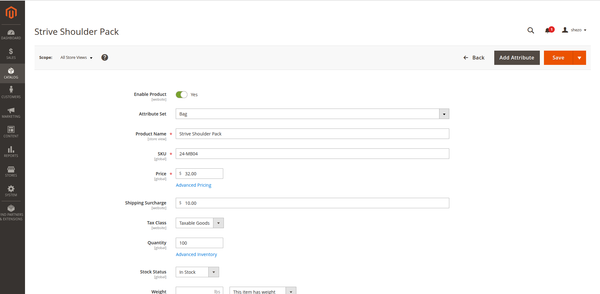
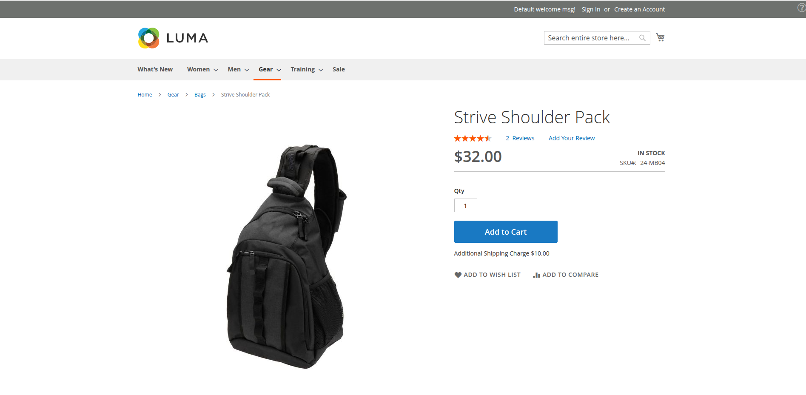

# Market_ShippingSurcharge

Magento 2 module that adds a per-product `shipping_surcharge` attribute and the necessary database columns to carry the surcharge amount through the quote, order, invoice, and credit memo lifecycle. It also displays the surcharge on the product detail page and provides a customisable explanatory note via a CMS static block.

## Screenshots

### Admin — Product Edit



The `Shipping Surcharge` price field appears in the **General** attribute group, scoped at the website level, alongside Price and Tax Class.

### Frontend — Product Detail Page



When a surcharge is set, an **Additional Shipping Charge** notice is rendered below the Add to Cart button.

## Overview

The `shipping_surcharge` attribute is a decimal price field scoped at the **website level**, meaning the surcharge can differ per website. It is intended to be read by shipping logic (e.g. a plugin or observer on the quote/order) to apply the extra cost at checkout.

The module also:

- Injects a surcharge amount block on the product detail page (`catalog_product_view` layout).
- Creates a CMS static block (`surcharge_explanatory_note`) that is rendered as tooltip/note text alongside the surcharge amount. The block content is editable in **Content > Blocks** without a code deploy.

## Installation

### Manual

1. Copy the module to `app/code/Market/ShippingSurcharge`
2. Run the following commands:

```bash
bin/magento module:enable Market_ShippingSurcharge
bin/magento setup:upgrade
bin/magento setup:di:compile
bin/magento setup:static-content:deploy
bin/magento cache:flush
```

### Via Composer

```bash
composer require market/module-shipping-surcharge
bin/magento module:enable Market_ShippingSurcharge
bin/magento setup:upgrade
bin/magento setup:di:compile
bin/magento setup:static-content:deploy
bin/magento cache:flush
```

## Configuration

After installation, navigate to:

### Stores > Configuration > Market > Shipping Surcharge

| Field                     | Description                                       |
|---------------------------|---------------------------------------------------|
| Enable Shipping Surcharge | Enable or disable the surcharge feature globally  |

The surcharge total sort order can be configured under:

**Stores > Configuration > Sales > Sales > Checkout Totals Sort Order > Shipping Surcharge** (default: `35`)

## Attribute Details

| Property                | Value                |
|-------------------------|----------------------|
| Attribute code          | `shipping_surcharge` |
| Type                    | `decimal`            |
| Input                   | `price`              |
| Scope                   | Website              |
| Group                   | General              |
| Required                | No                   |
| Used in product listing | Yes                  |
| Visible on frontend     | No                   |

## Frontend Display

The layout handle `catalog_product_view.xml` inserts the surcharge block into both `product.info.addtocart` and `product.info.addtocart.additional`. The block is rendered only when the product has a non-zero surcharge value.

### Explanatory Note CMS Block

A CMS static block with identifier `surcharge_explanatory_note` is created automatically on `setup:upgrade`. Its default content is:

> An additional shipping charge is required due to the product's size or weight, or because it requires additional packaging.

You can edit this text under **Content > Blocks > Surcharge Note** without redeploying code.

## Database Changes

Adds `shipping_surcharge` columns to the following tables:

| Table                   | Columns                                                                                                            |
|-------------------------|--------------------------------------------------------------------------------------------------------------------|
| `quote`                 | `shipping_surcharge`                                                                                               |
| `quote_item`            | `shipping_surcharge`                                                                                               |
| `sales_order`           | `shipping_surcharge`, `base_shipping_surcharge`, `shipping_surcharge_refunded`, `base_shipping_surcharge_refunded` |
| `sales_order_item`      | `shipping_surcharge`, `base_shipping_surcharge`                                                                    |
| `sales_invoice`         | `shipping_surcharge`, `base_shipping_surcharge`                                                                    |
| `sales_invoice_item`    | `shipping_surcharge`, `base_shipping_surcharge`                                                                    |
| `sales_creditmemo`      | `shipping_surcharge`, `base_shipping_surcharge`                                                                    |
| `sales_creditmemo_item` | `shipping_surcharge`, `base_shipping_surcharge`                                                                    |

## Uninstalling

```bash
bin/magento module:uninstall Market_ShippingSurcharge
bin/magento setup:upgrade
bin/magento cache:flush
```

This will trigger the `revert()` method on the data patch, removing the `shipping_surcharge` product attribute. Note that database columns added via `db_schema.xml` will also be removed automatically.

## Dependencies

- `Magento_Catalog`
- `Magento_Sales`
- `Magento_Eav`
- `Magento_Cms`
